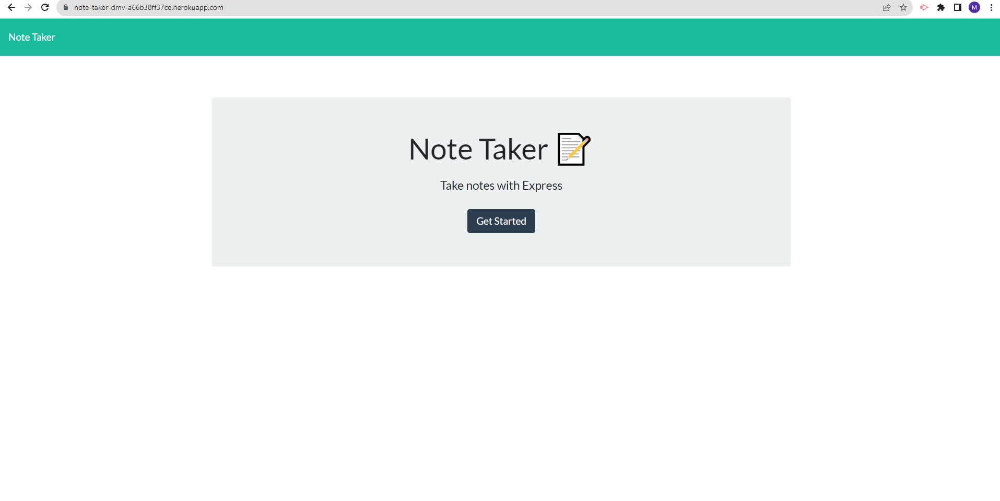

# Express.js-Challenge-Note-Taker
Module 11 Assignment for the Bootcamp is to debug a Note Taker. 

# Table of Contents 
* [User Story](#User-Story)
* [Acceptance Criteria](#Acceptance-Criteria)
* [Usage](#Usage)
* [Contributing](#Contributing)
* [Tests](#Tests)
* [Screenshots](#Screenshots)
* [Code Location](#Code)
* [Questions](#Contact-Information)

# User Story
AS A small business owner
I WANT to be able to write and save notes
SO THAT I can organize my thoughts and keep track of tasks I need to complete

# Acceptance Criteria
GIVEN a note-taking application
WHEN I open the Note Taker
THEN I am presented with a landing page with a link to a notes page
WHEN I click on the link to the notes page
THEN I am presented with a page with existing notes listed in the left-hand column, plus empty fields to enter a new note title and the note’s text in the right-hand column
WHEN I enter a new note title and the note’s text
THEN a "Save Note" button and a "Clear Form" button appear in the navigation at the top of the page
WHEN I click on the Save button
THEN the new note I have entered is saved and appears in the left-hand column with the other existing notes and the buttons in the navigation disappear
WHEN I click on an existing note in the list in the left-hand column
THEN that note appears in the right-hand column and a "New Note" button appears in the navigation
WHEN I click on the "New Note" button in the navigation at the top of the page
THEN I am presented with empty fields to enter a new note title and the note’s text in the right-hand column and the button disappears

# Usage
 You can use this database as a starting point to customize and build your own Note Taker.

# Contributing 
Download the source code and add additional styling options as needed.

# Tests
This was tested using Heroku.

# Screenshots

# Code
* Heroku Deployed Site: https://note-taker-dmv-a66b38ff37ce.herokuapp.com/
* Github: https://github.com/DMylesVaughn/Note-Taker

# Contact Information 
* GitHub Username: DMylesVaughn
* Contact Email: d.myles.vaughn@gmail.com